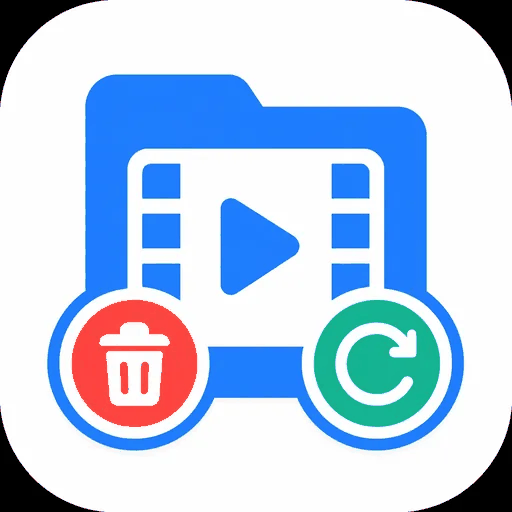

  

<h1 align="center">Kodi Managarr</h1>

<strong>Manage Radarr and Sonarr from your Kodi library.</strong>

  
  
  
  
  

Kodi Managarr adds a **Managarr** menu to movies, TV shows, and episodes in the Kodi library. It sends your chosen action to Radarr or Sonarr. It uses Kodi menus and dialogs, so it does not open a web browser.

Managarr does not replace Radarr, Sonarr, your download client, or Kodi. Those services must already be installed and working.

## What Managarr can do

- Show the Radarr or Sonarr status of a Kodi library item.
- Search for a movie, series, or episode now.
- Add an unmanaged movie or series, then start a search.
- Show release results and let you select one.
- Monitor or unmonitor media.
- Change the quality profile of a movie or series.
- View or remove matching download-queue items.
- Show a simple service dashboard.
- Find subtitles through Bazarr.
- Delete and exclude media.
- Delete a file, blocklist its release, and search for a replacement.
- Preview or run optional watched-media retention rules.

Destructive features are protected by confirmations, dry-run options, strict matching, path checks, and an optional PIN.

## What you need

### Required

- Kodi 19 or newer with Python 3.
- At least one of these services:
  - Radarr for movies.
  - Sonarr for TV shows and episodes.
- Network access from the Kodi device to the service.
- Movies and TV shows added to the Kodi video library.

### Optional

- Bazarr for subtitle search and download.
- Prowlarr for extra status and indexer information.
- A Kodi keymap tool for direct remote-button shortcuts.

## Install

1. Open the [Kodi Managarr repository page](https://cbkii.github.io/kodi-managarr/).
2. Download the file named `repository.managarr-X.Y.Z.zip`.
3. In Kodi, enable **Unknown sources** when Kodi asks for permission.
4. Open **Add-ons**.
5. Select **Install from zip file**.
6. Select the repository ZIP that you downloaded.
7. Select **Install from repository**.
8. Open **Kodi Managarr Repository**.
9. Open **Context menus**.
10. Install **Kodi Managarr**.

Keep Kodi add-on updates enabled to receive new stable versions from the repository.

## First setup

Open:

**Kodi Settings → Add-ons → My add-ons → Context menus → Kodi Managarr → Configure**

### 1. Connect Radarr

Open the **Radarr** settings category.

- Enable Radarr.
- Enter the Radarr URL that the Kodi device can reach.
- Enter the Radarr API key.
- Select **Test Radarr connection**.

Use the address of the Radarr web interface. Use the correct protocol, host name or IP address, port, and reverse-proxy path when one is configured.

### 2. Connect Sonarr

Open the **Sonarr** settings category.

- Enable Sonarr.
- Enter the Sonarr URL that the Kodi device can reach.
- Enter the Sonarr API key.
- Select **Test Sonarr connection**.

You can disable Radarr or Sonarr when you do not use that service.

### 3. Keep the safe defaults

For your first tests:

- Keep **Dry run** enabled.
- Keep confirmations enabled.
- Keep **Require release-history match** enabled.
- Use **Servarr API deletion**, which is the recommended deletion method.

Dry run shows what a destructive action would do without deleting media.

### 4. Configure Request & Search

Open **Configure Request & Search defaults**.

Choose:

- One Radarr root folder and quality profile.
- One Sonarr root folder and quality profile.
- The Sonarr monitoring mode.

These choices are used when Managarr adds a movie or series that is not already managed.

### 5. Choose your menu layout

Open the **Menu** settings category.

- Use **Simple** for common actions only.
- Use **Advanced** for the full menu.
- Use **TV-remote menu editor** to show, hide, or move items.
- Use **Preview resolved menu** to see the final result.

Each numbered item has a menu position:

- `0` hides the item.
- A lower positive number places the item earlier.
- Numbers such as `10`, `20`, and `30` leave space for later changes.

See [Menu layout](docs/MENU_LAYOUT.md) for the complete behaviour.

## Use Managarr

1. Open a Kodi library view for movies, TV shows, or episodes.
2. Focus the item that you want to manage.
3. Open the Kodi context menu.
4. Select **Managarr**.
5. Select an action.
6. Read the result or confirmation before continuing.

The menu is for Kodi **library items**. It may not appear for an ordinary file that has not been added to the Kodi library.

## Suggested first test

Use a media item that already exists in Radarr or Sonarr.

1. Run **Status**.
2. Run **Search & download now** only when a search is safe for that item.
3. Open **Monitoring** and check the current state.
4. Test **Delete & Exclude** or **Delete & Replace** only while **Dry run** is enabled.
5. Read the dry-run result and confirmation text.
6. Disable dry run only after the result matches your intended setup.

## Optional services

### Bazarr subtitles

1. Open the **Bazarr** settings category.
2. Enable Bazarr.
3. Enter its URL and API key.
4. Select **Configure subtitle languages**.
5. Select one to three languages in preference order.
6. Run **Test Bazarr connection**.

During movie or episode playback, open Kodi's normal subtitle-search window and select the Kodi Managarr or Bazarr provider.

### Prowlarr information

Enable Prowlarr and enter its URL and API key when you want extra dashboard and indexer information.

Managarr does not use Prowlarr to download or delete media. Radarr and Sonarr remain responsible for those actions.

## Retention cleanup

Retention can find watched media that matches your age rules. It can run manually or on a schedule.

Retention is disabled on a new installation. Movie cleanup and episode cleanup are also disabled separately.

Before allowing deletion:

1. Enable only the media types that you need.
2. Set the age and protection rules.
3. Keep both retention dry-run options enabled.
4. Run **Retention preview**.
5. Review **Last retention report**.
6. Set a low maximum deletion limit.
7. Enable real deletion only after several correct previews.

Read [Advanced configuration](docs/ADVANCED_CONFIGURATION.md#retention) before enabling real or scheduled retention.

## PIN protection

Use **Manage PIN** to create a local 4 to 8 digit PIN. The PIN protects destructive actions and real retention cleanup.

The PIN helps prevent accidental use from the Kodi interface. It is not protection against a person who can edit Kodi's local add-on files.

## Troubleshooting

### A connection test fails

- Confirm that the URL opens from another device on the same network.
- Confirm that the Kodi device can reach the same address.
- Check the API key.
- Check the port and reverse-proxy path.
- Check HTTPS certificate settings when you use HTTPS.
- Do not use `localhost` unless Radarr or Sonarr runs on the same device as Kodi.

### Managarr cannot find the selected item

- Confirm that the item is in the Kodi video library.
- Confirm that the same movie or series exists in Radarr or Sonarr.
- Check that Kodi and the service use matching TMDb or TVDb information.
- Configure a path mapping when Kodi and the server use different media paths.

### The Managarr menu does not appear

- Confirm that the add-on is enabled.
- Use a Kodi library movie, TV show, or episode.
- Check **Menu** settings for items set to `0`.
- Select **Restore menu defaults** when needed.

### More information is needed

Open **Tools & settings → Write diagnostics**. Managarr writes a non-secret diagnostics file and shows its location. Attach that file and the relevant Kodi log section to a [GitHub issue](https://github.com/cbkii/kodi-managarr/issues).

Do not post API keys, passwords, private URLs, or media credentials.

## More documentation

### For advanced users

- [Advanced configuration](docs/ADVANCED_CONFIGURATION.md) — deletion methods, path mappings, retention rules, PIN behaviour, keymaps, and technical safety details.
- [Menu layout](docs/MENU_LAYOUT.md) — numbered positions, visibility, submenus, flattening, migration, and recovery.
- [Android Kodi validation](docs/ANDROID_KODI_VALIDATION.md) — manual testing on a Kodi Android device.

### For contributors and maintainers

- [Contributing](CONTRIBUTING.md) — development setup and required checks.
- [Architecture](docs/ARCHITECTURE.md) — runtime boundaries and design decisions.
- [Agent sources](docs/AGENT_SOURCES.md) — authoritative Kodi and Servarr references.
- [Release checklist](docs/RELEASE_CHECKLIST.md) — release validation and publication steps.

## Compatibility

- Kodi 19 or newer.
- Kodi Python 3 runtime.
- Designed for Kodi on Android TV.
- Also testable on other Kodi platforms that meet the same requirements.
- Kodi 18 and Python 2 are not supported.

## Privacy and security

Managarr communicates directly with the service URLs that you configure. It does not send your library or API keys to a Managarr cloud service.

API keys and credential-bearing URLs are excluded from Managarr diagnostics, subtitle cache state, and normal logs. Kodi stores hidden settings locally, not in an encrypted vault. Protect access to the Kodi device and its profile data.

## Licence

Kodi Managarr is available under the [GPL-3.0-or-later licence](LICENSE.txt).